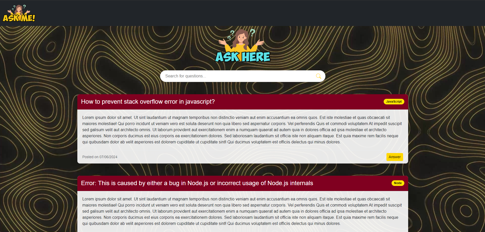
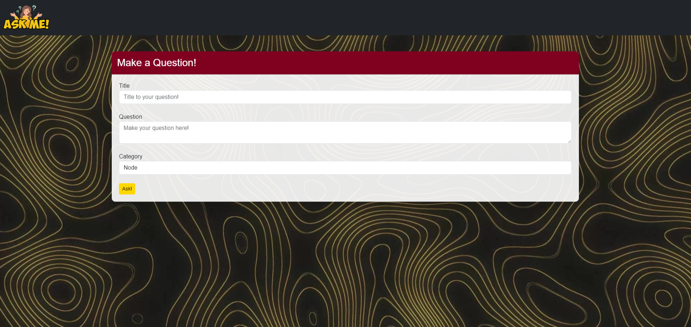
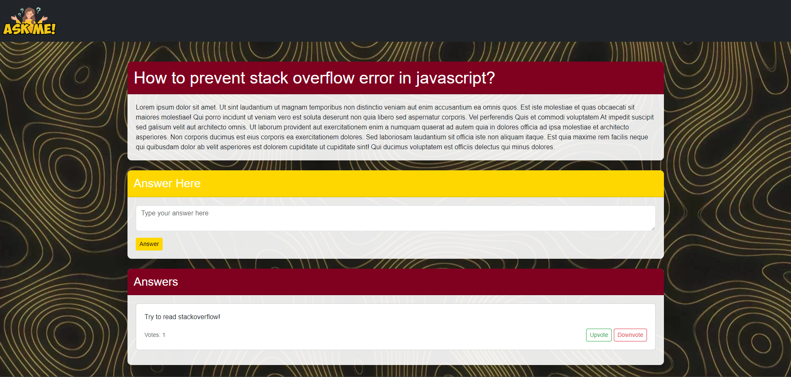

<h1 align="center">ASKME</h1>

## 📕 Description

Askme is a web application for anonymous questions and answers, inspired by Yahoo Answers. Developed with Node.js and JavaScript, the application uses MySQL for data storage, ensuring a simple and intuitive interaction for users.

## 📖 Libraries Used
- **body-parse**: `^0.1.0`
  - Middleware para analisar corpos de solicitação (request bodies) em objetos JavaScript, permitindo acesso fácil aos dados enviados em formulários HTML e outras solicitações POST.
  
- **ejs**: `^3.1.10`
  - Embedded JavaScript templates, uma ferramenta de template engine que permite gerar HTML com JavaScript simples. Facilita a renderização de páginas dinâmicas no servidor.
  
- **express**: `^4.19.2`
  - Framework de aplicação web minimalista e flexível para Node.js, fornece um robusto conjunto de funcionalidades para aplicações web e móveis.
  
- **mysql2**: `^3.10.0`
  - Driver para o MySQL, permite que as aplicações Node.js se conectem e interajam com bancos de dados MySQL.
  
- **sequelize**: `^6.37.3`
  - ORM (Object-Relational Mapper) para Node.js, facilita a manipulação e interação com bancos de dados SQL usando modelos JavaScript.

## 💻 Technologies Used
- **Node.js**: A JavaScript runtime environment that executes JavaScript code server-side.
- **JavaScript**: The programming language used for both front-end and back-end.
- **MySQL**: A relational database management system used to store questions and answers.
- **Sequelize**: An ORM (Object-Relational Mapping) for Node.js, used to connect and interact with the MySQL database.

## ⚒️ Features
- **Data Storage**: Utilizes MySQL to store information about questions and answers.
- **Database Connection**: Implemented with Sequelize, facilitating data manipulation and table generation.
- **Sorting and Conditional Search**: Uses Sequelize features to perform complex data queries and sorting operations.

## 🎖️ Project Objective
- This is a basic project created to exercise and enhance skills in Node.js and JavaScript, providing practical experience in building a complete web application. Additionally, the project aims to deepen knowledge in relational database manipulation using Sequelize and MySQL.

## Screenshots / Demo

Here are some screenshots and GIFs of the application in action:

### Homepage

### Asking a Question

### Viewing a Question

### Gif All Application

